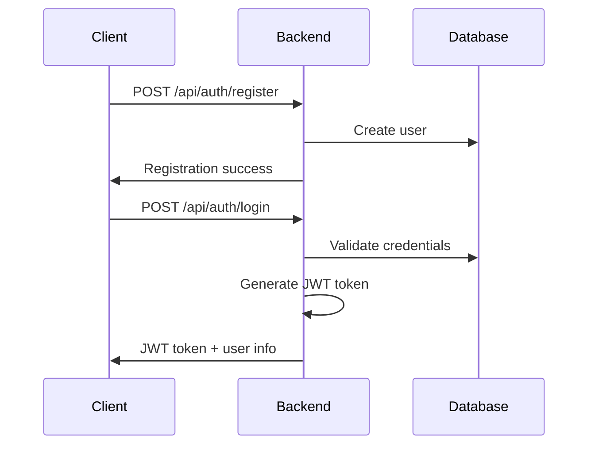
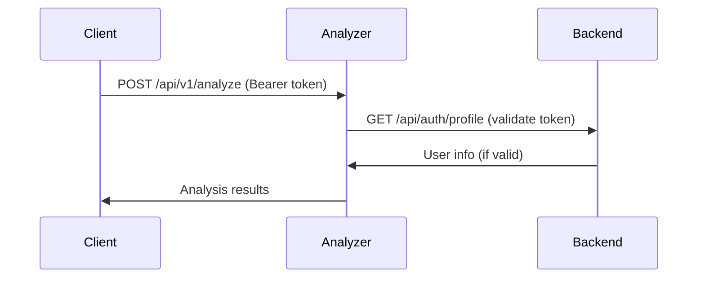

# SmartClause Authentication System

This document describes the comprehensive authentication and authorization system implemented across all SmartClause microservices.

## Architecture Overview

The SmartClause platform uses a **JWT-based authentication system** with the following architecture:

```
┌─────────────┐    ┌─────────────┐    ┌─────────────┐
│   Frontend  │    │    Chat     │    │  Analyzer   │
│   (Vue.js)  │    │  (FastAPI)  │    │  (FastAPI)  │
└─────────────┘    └─────────────┘    └─────────────┘
       │                   │                   │
       │                   │                   │
       └───────────────────┼───────────────────┘
                           │
                ┌─────────────┐
                │   Backend   │
                │ (Spring Boot)│
                │             │
                │ • JWT Gen   │
                │ • User Mgmt │
                │ • Auth API  │
                └─────────────┘
```

### Components

1. **Backend (Spring Boot)** - Central authentication authority
   - JWT token generation and validation
   - User registration and management
   - Authentication endpoints
   - Database user storage

2. **Chat Service (FastAPI)** - Protected chat functionality
   - Token validation via Backend service
   - User-specific chat sessions
   - Message access control

3. **Analyzer Service (FastAPI)** - Protected document analysis
   - Token validation via Backend service
   - User-specific analysis results
   - Document access control

## Authentication Flow

### 1. User Registration & Login



### 2. Service Access with Token



## Implementation Details

### Backend Service (Spring Boot)

**Technologies:**
- Spring Security
- JWT (JSON Web Tokens)
- BCrypt password hashing
- PostgreSQL for user storage

**Key Features:**
- ✅ User registration with email verification
- ✅ Secure password hashing (BCrypt)
- ✅ JWT token generation with claims
- ✅ Token validation and user lookup
- ✅ Role-based access control (USER, ADMIN)
- ✅ Profile management
- ✅ Password change functionality

**Endpoints:**
```http
POST   /api/auth/register     # User registration
POST   /api/auth/login        # User login
GET    /api/auth/profile      # Get user profile (authenticated)
PUT    /api/auth/profile      # Update profile (authenticated)
POST   /api/auth/verify-email # Email verification
PUT    /api/auth/password     # Change password (authenticated)
DELETE /api/auth/account      # Deactivate account (authenticated)
```

### Chat Service (FastAPI)

**Technologies:**
- FastAPI
- JWT token validation via Backend
- User context in chat operations

**Key Features:**
- ✅ Token validation with Backend service
- ✅ User-specific chat sessions
- ✅ Message access control
- ✅ Space-based authorization

**Protected Endpoints:**
```http
GET    /api/v1/spaces/{space_id}/messages     # Requires auth
POST   /api/v1/spaces/{space_id}/messages     # Requires auth
GET    /api/v1/spaces/{space_id}/session      # Requires auth
PUT    /api/v1/spaces/{space_id}/session/memory # Requires auth
```

### Analyzer Service (FastAPI)

**Technologies:**
- FastAPI
- JWT token validation via Backend
- User context in analysis operations
- PostgreSQL for analysis storage

**Key Features:**
- ✅ Token validation with Backend service
- ✅ User-specific analysis results
- ✅ Document access control
- ✅ Analysis result persistence with user context

**Protected Endpoints:**
```http
POST   /api/v1/analyze           # Requires auth
POST   /api/v1/retrieve-rules    # Requires auth
POST   /api/v1/retrieve-chunk    # Requires auth
POST   /api/v1/embed             # Requires auth
GET    /api/v1/metrics/retrieval # Requires auth
GET    /api/v1/export/{doc_id}/pdf # Requires auth
```

## Security Features

### 1. Authentication
- **JWT Tokens**: Secure, stateless authentication
- **Token Expiration**: Configurable token lifetime (default: 24 hours)
- **Password Security**: BCrypt hashing with salt
- **Email Verification**: Required for account activation

### 2. Authorization
- **Role-Based Access**: USER and ADMIN roles
- **Resource Ownership**: Users can only access their own data
- **Cross-Service Validation**: All services validate tokens with Backend

### 3. Security Headers
- **Bearer Token Format**: Standard `Authorization: Bearer <token>`
- **CORS Configuration**: Proper cross-origin request handling
- **Input Validation**: Comprehensive request validation

## Database Security

### User Data Protection
```sql
-- Backend database (users table)
CREATE TABLE users (
    id UUID PRIMARY KEY,
    username VARCHAR(100) UNIQUE NOT NULL,
    email VARCHAR(255) UNIQUE NOT NULL,
    password VARCHAR(255) NOT NULL,  -- BCrypt hashed
    role VARCHAR(20) NOT NULL,
    is_active BOOLEAN NOT NULL,
    is_email_verified BOOLEAN NOT NULL,
    -- ... other fields
);

-- Analyzer database (analysis_results table)
CREATE TABLE analysis_results (
    id SERIAL PRIMARY KEY,
    document_id VARCHAR(255) NOT NULL,
    user_id VARCHAR(255) NOT NULL,      -- Associates with user
    analysis_points JSONB,
    created_at TIMESTAMP DEFAULT NOW()
);

-- Security indexes
CREATE INDEX analysis_results_user_id_idx ON analysis_results (user_id);
CREATE INDEX analysis_results_document_user_idx ON analysis_results (document_id, user_id);
```

### Data Isolation
- **User Scoping**: All analysis results are scoped to specific users
- **Query Filtering**: Database queries include user_id filters
- **Access Control**: Users cannot access other users' data

## Configuration

### Backend Configuration
```properties
# JWT Configuration
app.jwt.secret=${JWT_SECRET}
app.jwt.expiration=86400                    # 24 hours
app.jwt.refresh-expiration=604800           # 7 days
```

### Chat Service Configuration
```env
# Authentication
JWT_SECRET=your_jwt_secret_here
JWT_ALGORITHM=HS256
JWT_ACCESS_TOKEN_EXPIRE_MINUTES=30
```

### Analyzer Service Configuration
```env
# No direct JWT config needed - validates via Backend service
# httpx>=0.25.0 required for HTTP client requests
```

## Testing Authentication

### Test Script
Use the provided `test_authentication.py` script to test all authentication flows:

```bash
# Install dependencies
pip install aiohttp

# Run comprehensive auth tests
python test_authentication.py
```

### Manual Testing
```bash
# 1. Register a user
curl -X POST http://localhost:8000/api/auth/register \
  -H "Content-Type: application/json" \
  -d '{
    "username": "testuser",
    "email": "test@example.com",
    "password": "secure123",
    "first_name": "Test",
    "last_name": "User"
  }'

# 2. Login and get token
curl -X POST http://localhost:8000/api/auth/login \
  -H "Content-Type: application/json" \
  -d '{
    "username_or_email": "test@example.com",
    "password": "secure123"
  }'

# 3. Use token for protected endpoints
curl -X POST http://localhost:8001/api/v1/retrieve-rules \
  -H "Authorization: Bearer YOUR_TOKEN_HERE" \
  -H "Content-Type: application/json" \
  -d '{"query": "contract terms", "k": 5}'
```

## Error Handling

### Common Authentication Errors

| Status Code | Error | Description |
|-------------|-------|-------------|
| 401 | `Authentication required` | No token provided |
| 401 | `Invalid or expired token` | Token validation failed |
| 401 | `Authorization header must be in Bearer format` | Malformed header |
| 403 | `Insufficient permissions` | Valid token but no access |
| 409 | `Username already exists` | Registration conflict |

### Error Response Format
```json
{
  "error": "Authentication required. Please provide a valid Bearer token."
}
```

## Security Best Practices

### 1. Token Management
- **Secure Storage**: Store tokens securely on client side
- **Token Renewal**: Implement token refresh mechanism
- **Logout**: Clear tokens on logout

### 2. Development
- **Environment Variables**: Never hardcode secrets
- **HTTPS**: Use HTTPS in production
- **Rate Limiting**: Implement rate limiting for auth endpoints

### 3. Monitoring
- **Failed Login Attempts**: Monitor and alert on suspicious activity
- **Token Usage**: Track token usage patterns
- **Security Logs**: Comprehensive security event logging

## Migration Guide

### Existing Installations
If you have an existing SmartClause installation without authentication:

1. **Update Database Schema**:
   ```sql
   -- Add user_id column to analysis_results
   ALTER TABLE analysis_results ADD COLUMN user_id VARCHAR(255);
   CREATE INDEX analysis_results_user_id_idx ON analysis_results (user_id);
   ```

2. **Update Dependencies**:
   ```bash
   # Analyzer service
   pip install httpx>=0.25.0
   ```

3. **Environment Configuration**:
   - Set JWT_SECRET in backend environment
   - Configure service URLs for token validation

## Troubleshooting

### Common Issues

1. **"Backend token validation failed"**
   - Check if Backend service is running
   - Verify JWT_SECRET is consistent
   - Ensure user exists and is active

2. **"Database connection error"**
   - Verify PostgreSQL is running
   - Check database credentials
   - Ensure user_id column exists in analysis_results

3. **"CORS errors"**
   - Check CORS configuration in services
   - Verify allowed origins

4. **"Invalid token format"**
   - Ensure `Bearer ` prefix in Authorization header
   - Check token is properly encoded

### Debug Tips
- Enable debug logging for authentication components
- Use browser developer tools to inspect requests
- Test with curl commands to isolate issues
- Check service logs for detailed error messages

## Future Enhancements

### Planned Features
- [ ] Token refresh mechanism
- [ ] OAuth2 integration (Google, GitHub)
- [ ] Multi-factor authentication (MFA)
- [ ] API rate limiting per user
- [ ] Advanced role-based permissions
- [ ] Audit logging for security events
- [ ] Session management and revocation

### Security Improvements
- [ ] Password complexity requirements
- [ ] Account lockout after failed attempts
- [ ] Suspicious activity detection
- [ ] Token blacklisting
- [ ] Security headers middleware

---

For technical support or questions about the authentication system, please refer to the development team or create an issue in the project repository. 