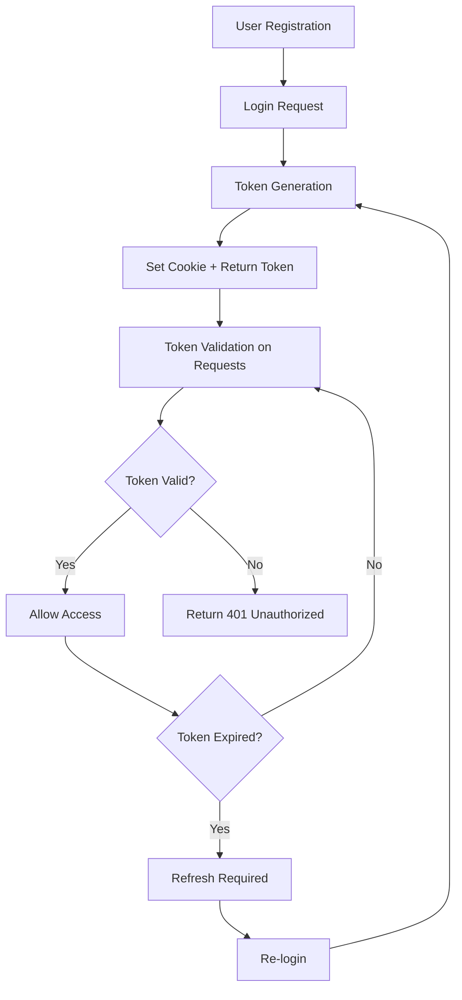

# Authentication Guide

SmartClause uses JWT (JSON Web Token) based authentication to secure API access across all microservices. This guide explains how to authenticate with the platform and manage user sessions.

## Table of Contents

- [Authentication Overview](#authentication-overview)
- [Token Management](#token-management)
- [Authentication Methods](#authentication-methods)
- [User Registration & Login](#user-registration--login)
- [Token Validation](#token-validation)
- [Service-to-Service Authentication](#service-to-service-authentication)
- [Security Best Practices](#security-best-practices)
- [Troubleshooting](#troubleshooting)

## Authentication Overview

### JWT Token Structure

SmartClause uses JWT tokens with the following structure:

```json
{
  "header": {
    "alg": "HS256",
    "typ": "JWT"
  },
  "payload": {
    "sub": "user-uuid",
    "username": "john_doe",
    "role": "USER",
    "iat": 1704067200,
    "exp": 1704153600
  },
  "signature": "..."
}
```

**Token Claims:**
- `sub`: User ID (subject)
- `username`: User's username
- `role`: User role (USER, ADMIN, SYSTEM)
- `iat`: Issued at timestamp
- `exp`: Expiration timestamp

### Token Delivery Methods

1. **HTTP-Only Cookies** (Recommended)
   - Cookie name: `smartclause_token`
   - Automatically included in requests
   - Secure, httpOnly, sameSite protection
   - Not accessible via JavaScript

2. **Authorization Header**
   - Header: `Authorization: Bearer <token>`
   - Manual inclusion required
   - Suitable for API clients and mobile apps

## Token Management

### Token Lifecycle



### Token Expiration

- **Default Expiration**: 24 hours (86400 seconds)
- **Refresh Strategy**: Re-login required (no refresh tokens)
- **Automatic Cleanup**: Expired tokens are automatically rejected

## Authentication Methods

### Method 1: HTTP-Only Cookies (Recommended)

**Login Process:**
```python
import requests

# Login and receive cookie
login_response = requests.post("http://localhost:8000/api/auth/login", json={
    "username_or_email": "user@example.com",
    "password": "securepassword"
})

# Cookie is automatically set by the server
# Subsequent requests will include the cookie automatically
session = requests.Session()
session.cookies = login_response.cookies

# Make authenticated requests
profile_response = session.get("http://localhost:8000/api/auth/profile")
```

**Cookie Properties:**
```http
Set-Cookie: smartclause_token=eyJhbGciOiJIUzI1NiIs...; 
            HttpOnly; 
            Secure; 
            SameSite=Strict; 
            Path=/; 
            Max-Age=86400
```

### Method 2: Authorization Header

**Manual Token Management:**
```python
import requests

# Login and extract token
login_response = requests.post("http://localhost:8000/api/auth/login", json={
    "username_or_email": "user@example.com",
    "password": "securepassword"
})

token = login_response.json()["access_token"]

# Use token in subsequent requests
headers = {"Authorization": f"Bearer {token}"}
profile_response = requests.get("http://localhost:8000/api/auth/profile", headers=headers)
```

## User Registration & Login

### Complete Registration Flow

```python
import requests

def register_user(username, email, password, first_name=None, last_name=None):
    """Register a new user account"""
    registration_data = {
        "username": username,
        "email": email,
        "password": password,
        "first_name": first_name,
        "last_name": last_name
    }
    
    response = requests.post(
        "http://localhost:8000/api/auth/register",
        json=registration_data
    )
    
    if response.status_code == 201:
        user_data = response.json()
        print(f"User registered successfully: {user_data['user']['username']}")
        print(f"Email verification required: {user_data['email_verification_required']}")
        return user_data
    else:
        print(f"Registration failed: {response.json().get('error')}")
        return None

# Register new user
user = register_user(
    username="john_doe",
    email="john@example.com", 
    password="securepassword123",
    first_name="John",
    last_name="Doe"
)
```

### Login with Session Management

```python
def login_user(username_or_email, password):
    """Login user and return session with cookie authentication"""
    login_data = {
        "username_or_email": username_or_email,
        "password": password
    }
    
    session = requests.Session()
    response = session.post(
        "http://localhost:8000/api/auth/login",
        json=login_data
    )
    
    if response.status_code == 200:
        user_data = response.json()
        print(f"Login successful: {user_data['user']['username']}")
        print(f"Token expires in: {user_data['expires_in']} seconds")
        return session, user_data
    else:
        print(f"Login failed: {response.json().get('error')}")
        return None, None

# Login and get authenticated session
session, user_data = login_user("john@example.com", "securepassword123")

if session:
    # Use session for authenticated requests
    profile = session.get("http://localhost:8000/api/auth/profile")
    print("Profile:", profile.json())
```

## Token Validation

### Validating Tokens Across Services

All microservices validate JWT tokens by communicating with the backend service:

```python
def validate_token_with_backend(token):
    """Validate token with backend service"""
    headers = {"Authorization": f"Bearer {token}"}
    
    try:
        response = requests.get(
            "http://backend:8000/api/auth/profile",
            headers=headers,
            timeout=5.0
        )
        
        if response.status_code == 200:
            user_data = response.json()
            return True, user_data
        else:
            return False, None
            
    except requests.RequestException as e:
        print(f"Token validation failed: {e}")
        return False, None

# Example usage in service
def protected_endpoint(request, authorization_header):
    """Example of protected endpoint implementation"""
    
    # Extract token
    token = None
    if authorization_header and authorization_header.startswith("Bearer "):
        token = authorization_header[7:]
    elif request.cookies.get("smartclause_token"):
        token = request.cookies.get("smartclause_token")
    
    if not token:
        return {"error": "Authentication required"}, 401
    
    # Validate token
    is_valid, user_data = validate_token_with_backend(token)
    
    if not is_valid:
        return {"error": "Invalid or expired token"}, 401
    
    # Process request with user context
    user_id = user_data["id"]
    return process_user_request(user_id)
```

### Token Extraction Utility

```python
def extract_token_from_request(request, authorization_header=None):
    """Extract JWT token from request (cookie or header)"""
    
    # Priority 1: Cookie (recommended)
    token = request.cookies.get("smartclause_token")
    if token and token.strip():
        return token.strip()
    
    # Priority 2: Authorization header
    if authorization_header and authorization_header.startswith("Bearer "):
        token = authorization_header[7:].strip()
        if token:
            return token
    
    return None
```

## Service-to-Service Authentication

### System Tokens

For internal service communication, SmartClause uses system tokens:

```python
def generate_system_token():
    """Generate system token for service-to-service communication"""
    import jwt
    import datetime
    
    payload = {
        "sub": "system",
        "username": "system",
        "role": "SYSTEM",
        "iat": datetime.datetime.utcnow(),
        "exp": datetime.datetime.utcnow() + datetime.timedelta(hours=1)
    }
    
    token = jwt.encode(payload, SECRET_KEY, algorithm="HS256")
    return token

# Example: Analyzer service calling backend
def call_backend_with_system_token(endpoint, data=None):
    """Make authenticated request to backend service"""
    system_token = generate_system_token()
    headers = {"Authorization": f"Bearer {system_token}"}
    
    if data:
        response = requests.post(f"http://backend:8000{endpoint}", 
                               headers=headers, json=data)
    else:
        response = requests.get(f"http://backend:8000{endpoint}", 
                              headers=headers)
    
    return response
```

### Service Authentication Flow

```python
# Example: Chat service authenticating analyzer request
def make_analyzer_request(user_token, endpoint, data):
    """Forward user authentication to analyzer service"""
    
    # Use the user's token for the analyzer request
    headers = {"Authorization": f"Bearer {user_token}"}
    
    response = requests.post(
        f"http://analyzer:8001{endpoint}",
        headers=headers,
        json=data
    )
    
    return response

# Usage in chat service
def process_chat_message(user_token, message):
    # Forward to analyzer with user authentication
    analysis_data = {"query": message, "k": 5}
    response = make_analyzer_request(user_token, "/retrieve-chunk", analysis_data)
    
    if response.status_code == 200:
        return response.json()
    else:
        raise Exception("Analyzer request failed")
```

## Security Best Practices

### Token Security

1. **Use HTTPS in Production**
   ```python
   # Always use HTTPS for token transmission
   SECURE_URLS = {
       "backend": "https://api.smartclause.com",
       "analyzer": "https://analyzer.smartclause.com", 
       "chat": "https://chat.smartclause.com"
   }
   ```

2. **Implement Proper Token Storage**
   ```javascript
   // Frontend: Use HTTP-only cookies (secure)
   // Never store tokens in localStorage or sessionStorage
   
   // Good: Let the server set HTTP-only cookies
   fetch('/api/auth/login', {
       method: 'POST',
       credentials: 'include', // Include cookies
       headers: { 'Content-Type': 'application/json' },
       body: JSON.stringify({ username, password })
   });
   ```

3. **Handle Token Expiration Gracefully**
   ```python
   def make_authenticated_request(session, url, **kwargs):
       """Make request with automatic re-authentication on token expiry"""
       response = session.get(url, **kwargs)
       
       if response.status_code == 401:
           # Token expired, re-authenticate
           login_result = re_authenticate(session)
           if login_result:
               # Retry original request
               response = session.get(url, **kwargs)
       
       return response
   ```

### Rate Limiting & Security

```python
# Check rate limit status before making requests
def check_rate_limits():
    """Check current rate limit status"""
    response = requests.get("http://localhost:8000/api/v1/rate-limit/status")
    
    if response.status_code == 200:
        limits = response.json()
        print(f"Requests remaining this hour: {limits['remaining']['hour']}")
        return limits['remaining']['hour'] > 0
    
    return False

# Use rate limiting in application logic
if check_rate_limits():
    # Proceed with API calls
    result = make_api_request()
else:
    print("Rate limit exceeded, waiting...")
    time.sleep(3600)  # Wait 1 hour
```

## Troubleshooting

### Common Authentication Issues

#### 1. Token Expired
```python
# Error: 401 Unauthorized
# Solution: Re-login to get new token

def handle_token_expiry(session):
    """Handle expired token by re-authenticating"""
    print("Token expired, re-authenticating...")
    
    # Clear old session
    session.cookies.clear()
    
    # Re-login
    new_session, user_data = login_user("user@example.com", "password")
    return new_session
```

#### 2. Invalid Token Format
```python
# Error: Malformed JWT token
# Solution: Ensure proper token format

def validate_token_format(token):
    """Validate JWT token format"""
    try:
        parts = token.split('.')
        if len(parts) != 3:
            return False, "Token must have 3 parts separated by dots"
        
        # Decode without verification (just format check)
        import base64
        import json
        
        header = json.loads(base64.b64decode(parts[0] + '=='))
        payload = json.loads(base64.b64decode(parts[1] + '=='))
        
        return True, "Token format is valid"
        
    except Exception as e:
        return False, f"Invalid token format: {e}"
```

#### 3. Cookie Issues
```python
# Error: Cookie not being sent
# Solution: Check cookie settings and domain

def debug_cookie_issues(session):
    """Debug cookie-related authentication issues"""
    
    print("Current cookies:")
    for cookie in session.cookies:
        print(f"  {cookie.name}: {cookie.value}")
        print(f"    Domain: {cookie.domain}")
        print(f"    Path: {cookie.path}")
        print(f"    Secure: {cookie.secure}")
        print(f"    HttpOnly: {cookie.has_nonstandard_attr('HttpOnly')}")
    
    # Check if smartclause_token exists
    token_cookie = session.cookies.get('smartclause_token')
    if not token_cookie:
        print("ERROR: smartclause_token cookie not found")
        return False
    
    return True
```

#### 4. Cross-Service Authentication
```python
# Error: Service-to-service authentication failing
# Solution: Verify system token generation

def debug_system_authentication():
    """Debug system token issues"""
    try:
        system_token = generate_system_token()
        print(f"Generated system token: {system_token[:50]}...")
        
        # Test token with backend
        headers = {"Authorization": f"Bearer {system_token}"}
        response = requests.get("http://backend:8000/api/auth/profile", headers=headers)
        
        if response.status_code == 200:
            print("System authentication successful")
            return True
        else:
            print(f"System authentication failed: {response.status_code}")
            print(f"Response: {response.text}")
            return False
            
    except Exception as e:
        print(f"System token generation failed: {e}")
        return False
```

### Testing Authentication

```python
def test_authentication_flow():
    """Comprehensive authentication flow test"""
    
    print("=== Testing Authentication Flow ===")
    
    # 1. Test registration
    print("\n1. Testing user registration...")
    user_data = register_user("test_user", "test@example.com", "testpass123")
    assert user_data is not None, "Registration failed"
    
    # 2. Test login
    print("\n2. Testing user login...")
    session, login_data = login_user("test@example.com", "testpass123")
    assert session is not None, "Login failed"
    
    # 3. Test authenticated request
    print("\n3. Testing authenticated request...")
    profile_response = session.get("http://localhost:8000/api/auth/profile")
    assert profile_response.status_code == 200, "Profile request failed"
    
    # 4. Test token header method
    print("\n4. Testing token header authentication...")
    token = login_data["access_token"]
    headers = {"Authorization": f"Bearer {token}"}
    header_response = requests.get("http://localhost:8000/api/auth/profile", headers=headers)
    assert header_response.status_code == 200, "Header authentication failed"
    
    # 5. Test cross-service authentication
    print("\n5. Testing cross-service authentication...")
    analyzer_response = requests.post(
        "http://localhost:8001/embed",
        headers=headers,
        json={"text": "test text"}
    )
    assert analyzer_response.status_code == 200, "Cross-service authentication failed"
    
    print("\n✅ All authentication tests passed!")

# Run tests
if __name__ == "__main__":
    test_authentication_flow()
```

---

*For specific API endpoint authentication requirements, see the individual service documentation:*
- *[Backend API](./backend-api.md)*
- *[Analyzer API](./analyzer-api.md)*  
- *[Chat API](./chat-api.md)* 